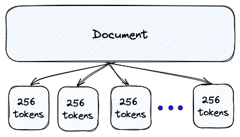

# MedExplainer-Langchain-RAG-LLM
Leverage RAG: Retrieval Augmented Generation to locate the nearest embeddings for a given question and load it into the LLM context window for enhanced accuracy on retrieval. Answer medical questions based on Vector Retrieval.

# Model
Uses `HuggingFaceH4/zephyr-7b-beta` a finetune on Model: `https://huggingface.co/mistralai/Mistral-7B-v0.1`.

Zephyr-7B was trained on on a mix of publicly available, synthetic datasets using Direct Preference Optimization (DPO).

# RAG [Vector DB based Semantic Retrieval]
We split the documents from our knowledge base into smaller chunks, to ensure chunk lengths are with our limit of 512 tokens on Model Inference. 

Recursive chunking breaks down the text into smaller parts step by step using a given list of separators sorted from the most important to the least important separator.

 # Source Pinecone

# Embedding Dataset
We use MedRag an Embedding Dataset from Huggingface with 127k embeddings: https://huggingface.co/datasets/MedRAG/textbooks
